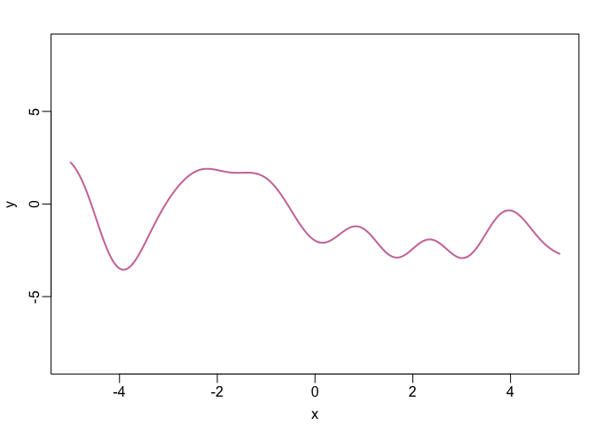
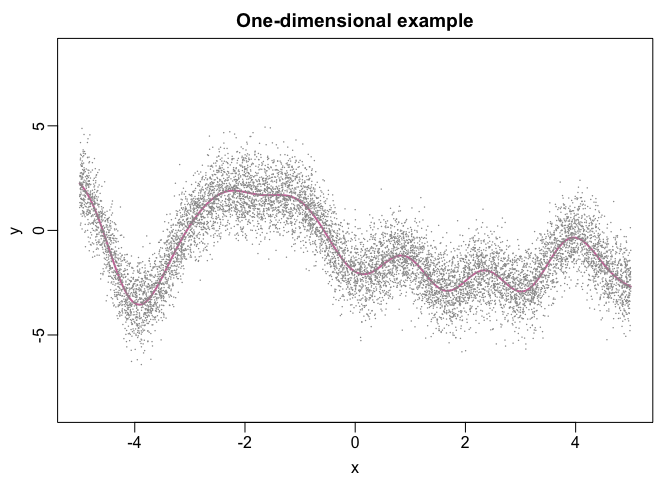
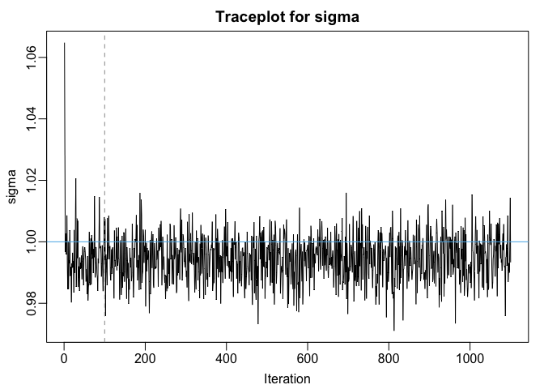
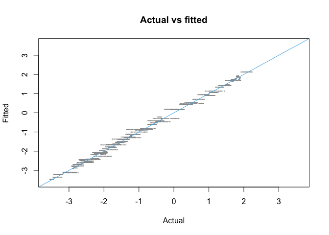
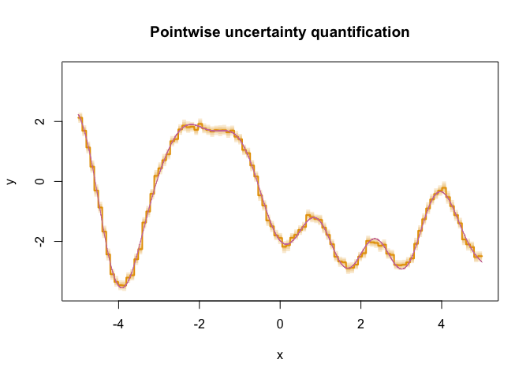
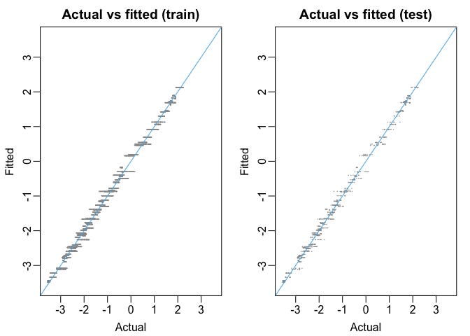
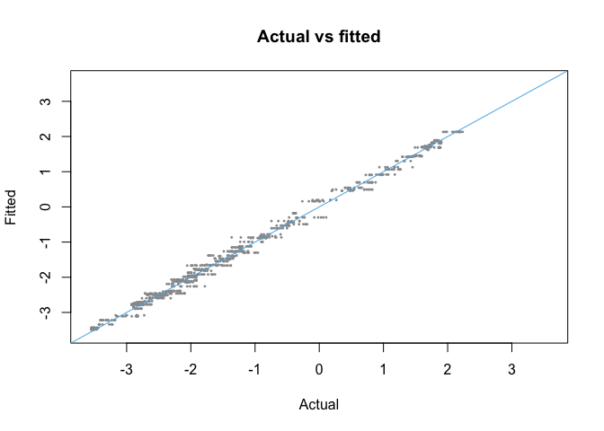
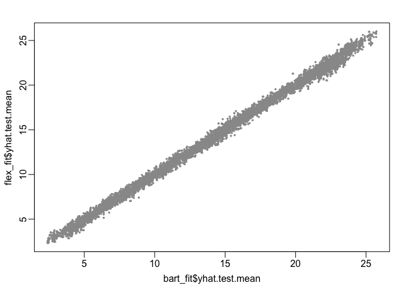

BART Basics
================
2024-05-18

## Setup

We’ll start by loading a color-blind friendly palette

``` r
my_colors <- c("#999999", "#E69F00", "#56B4E9", "#009E73", 
               "#F0E442", "#0072B2", "#D55E00", "#CC79A7")
```

## BART in one dimension

We will illustrate the use of the **BART** package using a simple
synthetic data example in which the input

is one-dimensional. For this example, we will generate

pairs
, \ldots, (x_{n}, y_{n})")
of covariates
![x\_{i} \in \[0,1\]](https://latex.codecogs.com/png.image?%5Cdpi%7B110%7D&space;%5Cbg_white&space;x_%7Bi%7D%20%5Cin%20%5B0%2C1%5D "x_{i} \in [0,1]")
and outcomes

where
, 1).")
We will use a rather non-linear function

which is defined in the following code block.

``` r
set.seed(129)
D <- 5000
omega0 <- rnorm(n = D, mean = 0, sd = 1.5)
b0 <- 2 * pi * runif(n = D, min = 0, max = 1)
beta0 <- rnorm(n = D, mean = 0, sd = 2*1/sqrt(D))

f0 <- function(x){
  if(length(x) == 1){
    phi <- sqrt(2) * cos(b0 + omega0*x)
    out <- sum(beta0 * phi)
  } else{
    phi_mat <- matrix(nrow = length(x), ncol = D)
    for(d in 1:D){
      phi_mat[,d] <- sqrt(2) * cos(b0[d] + omega0[d] * x)
    }
    out <- phi_mat %*% beta0
  }
  return(out)
}
```

To visualize the function, we define a fine grid of values between -5
and 5 and evaluated the function at every point in the grid.

``` r
x_grid <- seq(-5, 5, by = 0.01)
f_grid <- f0(x_grid)

par(mar = c(3,3,2,1), mgp = c(1.8, 0.5, 0))
plot(1, type = "n", xlim = c(-5,5), ylim = c(-8.5, 8.5),
     xlab = expression(x), ylab = expression(y))
lines(x_grid, f_grid, col = my_colors[8], lwd = 2)
```



### Generate data

We’re now ready to generate some training data. To assess how well BART
is able to predict
")
out-of-sample, we will also create some test set data.

``` r
set.seed(518)
sigma <- 1
x_train <- data.frame(x = sort(runif(1e4, -5, 5)))
f_train <- f0(x_train$x)

x_test <- data.frame(x = sort(runif(1e3, -5, 5)))
f_test <- f0(x_test$x)

y_train <- f_train + rnorm(1e4, mean = 0, sd = sigma)

par(mar = c(3,3,2,1), mgp = c(1.8, 0.5, 0))
plot(1, type = "n", xlim = c(-5,5), ylim = c(-8.5, 8.5),
     xlab = "x", ylab = "y", main = "One-dimensional example")
lines(x_grid, f_grid, col = my_colors[8], lwd = 2)
points(x_train[,1], y_train, pch = 16, cex = 0.2, col = my_colors[1])
```



### Running BART

We will use the function `wbart()` from the **BART** package. By
default, it simulations a Markov chain for 1100 iterations and discards
the first 100 as “burn-in.” It also prints a lot of output to the
console, most of which can be safely ignored for now.

``` r
fit1 <-
  BART::wbart(x.train = x_train,
              y.train = y_train)
```

    ## *****Into main of wbart
    ## *****Data:
    ## data:n,p,np: 10000, 1, 0
    ## y1,yn: 2.031770, -0.015586
    ## x1,x[n*p]: -4.998912, 4.999575
    ## *****Number of Trees: 200
    ## *****Number of Cut Points: 100 ... 100
    ## *****burn and ndpost: 100, 1000
    ## *****Prior:beta,alpha,tau,nu,lambda: 2.000000,0.950000,0.200690,3.000000,0.654577
    ## *****sigma: 1.833139
    ## *****w (weights): 1.000000 ... 1.000000
    ## *****Dirichlet:sparse,theta,omega,a,b,rho,augment: 0,0,1,0.5,1,1,0
    ## *****nkeeptrain,nkeeptest,nkeeptestme,nkeeptreedraws: 1000,1000,1000,1000
    ## *****printevery: 100
    ## *****skiptr,skipte,skipteme,skiptreedraws: 1,1,1,1
    ## 
    ## MCMC
    ## done 0 (out of 1100)
    ## done 100 (out of 1100)
    ## done 200 (out of 1100)
    ## done 300 (out of 1100)
    ## done 400 (out of 1100)
    ## done 500 (out of 1100)
    ## done 600 (out of 1100)
    ## done 700 (out of 1100)
    ## done 800 (out of 1100)
    ## done 900 (out of 1100)
    ## done 1000 (out of 1100)
    ## time: 42s
    ## check counts
    ## trcnt,tecnt,temecnt,treedrawscnt: 1000,0,0,1000

The function `wbart()` returns, essentially, a list with several
components

``` r
names(fit1)
```

    ##  [1] "sigma"           "yhat.train.mean" "yhat.train"      "yhat.test.mean" 
    ##  [5] "yhat.test"       "varcount"        "varprob"         "treedraws"      
    ##  [9] "proc.time"       "mu"              "varcount.mean"   "varprob.mean"   
    ## [13] "rm.const"

At this point, the most important components are `yhat.train`, which is
a matrix containing posterior samples of
,")
`yhat.train.mean,` which is a vector containing the posterior means of
the
,")
and `sigma,` which is a vector containing **all** samples of

(including burn-in). Note that `yhat.train.mean` is just the vector of
column means of `yhat.train`.

Let’s start by visualizing a traceplot of the

samples:

``` r
par(mar = c(3,3,2,1), mgp = c(1.8, 0.5, 0))
plot(fit1$sigma, type = "l", xlab = "Iteration", ylab = "sigma", main = "Traceplot for sigma")
abline(h = sigma, col = my_colors[3])
abline(v = 100, lty = 2, col = my_colors[1])
```


We see that all the posterior samples of

bounce around in a region just above the value used to generate our data
().
While this is not quite “proof” that the Markov chain has
mixed/converged, it does indicate that after the first 100 iterations,
the Markov chain is exploring tree ensemble space in such a way that the
overall fit to data (as measured by
)
is relatively stable.

To see that BART actually did a pretty decent job at estimating
,")
we will plot the posterior mean of the evaluations against the true
values of


``` r
fit_range <- c(-1.01,1.01) * max(abs(c(f_train, fit1$yhat.train.mean)))
plot(1, type = "n", xlim = fit_range, ylim = fit_range, main = "Actual vs fitted",
     xlab = "Actual", ylab = "Fitted")
points(f_train, fit1$yhat.train.mean, pch = 16, cex = 0.2, col = my_colors[1])
abline(a = 0, b = 1, col = my_colors[3])
```


It is reassuring to see that, for the most part, all the points line up
close to the 45-degree diagonal line!

### Uncertainty Quantification

To this point, we have only focused on the point predictions. But a main
draw of the Bayesian paradigm is the ease with which we can quantify our
uncertainty. We’ll start by computing point-wise posterior credible
intervals for evaluations
")
for each point on the grid. The code below creates a new data frame
(`grid_pred_sum`) with columns containing the posterior mean and several
quantiles of each evaluation.

``` r
fit1_sum <-
  data.frame(
    MEAN = apply(fit1$yhat.train, MARGIN = 2, FUN = mean),
    L95 = apply(fit1$yhat.train, MARGIN = 2, FUN = quantile, probs = 0.025),
    L80 = apply(fit1$yhat.train, MARGIN = 2, FUN = quantile, probs = 0.1),
    L50 = apply(fit1$yhat.train, MARGIN = 2, FUN = quantile, probs = 0.25),
    U50 = apply(fit1$yhat.train, MARGIN = 2, FUN = quantile, probs = 0.75),
    U80 = apply(fit1$yhat.train, MARGIN = 2, FUN = quantile, probs = 0.9),
    U95 = apply(fit1$yhat.train, MARGIN = 2, FUN = quantile, probs = 0.975))
```

We can visualize these point-wise intervals and posterior means as a
function of


``` r
y_lim <- c(-1.01, 1.01) * max(abs(fit1_sum))
plot(1, type = "n", xlim = c(-5,5), ylim = y_lim,
     xlab = "x", ylab = "y", main= "Pointwise uncertainty quantification")
polygon(x = c(x_train$x, rev(x_train$x)),
        y = c(fit1_sum$L95, rev(fit1_sum$U95)),
        border = NA,
        col = adjustcolor(my_colors[2], alpha.f = 0.2))
polygon(x = c(x_train$x, rev(x_train$x)),
        y = c(fit1_sum$L80, rev(fit1_sum$U80)),
        border = NA,
        col = adjustcolor(my_colors[2], alpha.f = 0.2))
polygon(x = c(x_train$x, rev(x_train$x)),
        y = c(fit1_sum$L50, rev(fit1_sum$U50)),
        border = NA,
        col = adjustcolor(my_colors[2], alpha.f = 0.2))
lines(x_train$x, fit1_sum$MEAN, col = my_colors[2], lwd = 2)
lines(x_train$x, f_train, col = my_colors[8])
```


As a function of

the posterior mean of
")
is pretty close to the true function (which is shown in pink). We also
see that the point-wise 95% uncertainty intervals are rather narrow,
indicating a high degree of certainty about the value of
")
for each training observation. It certainly looks like the true function
tends to lie mostly within these intervals. We can check the actual
frequentist coverage of our Bayesian uncertainty intervals for in-sample
evaluations of

with the following code.

``` r
mean(f_train >= fit1_sum$L95 & f_train <= fit1_sum$U95)
```

    ## [1] 0.8748

It should be noted that in finite samples, Bayesian credible intervals
generally do not have nominal frequentist coverage. But this is still
pretty good!

### Making a prediction

There are two main ways to make predictions about function evaluations
")
for some new

that is not necessarily in the training dataset. The first way (and for
many years, the only way) was to pass those new

values to `wbart` in the initial call using the `x.test` argument. That
is, one would supply both the training and testing data when calling
`wbart` and the function would return samples of

evaluated at every training point (in `yhat.train`) and every testing
point (`yhat.test`).

To illustrate this workflow, in the following code block, we will re-fit
our BART model and pass the testing data alongside the training data.
Then, we will visualize the quality of the fit.

``` r
fit1 <-
  BART::wbart(x.train = x_train,
              y.train = y_train,
              x.test = x_test)
```

    ## *****Into main of wbart
    ## *****Data:
    ## data:n,p,np: 10000, 1, 1000
    ## y1,yn: 2.031770, -0.015586
    ## x1,x[n*p]: -4.998912, 4.999575
    ## xp1,xp[np*p]: -4.996731, 4.994322
    ## *****Number of Trees: 200
    ## *****Number of Cut Points: 100 ... 100
    ## *****burn and ndpost: 100, 1000
    ## *****Prior:beta,alpha,tau,nu,lambda: 2.000000,0.950000,0.200690,3.000000,0.654577
    ## *****sigma: 1.833139
    ## *****w (weights): 1.000000 ... 1.000000
    ## *****Dirichlet:sparse,theta,omega,a,b,rho,augment: 0,0,1,0.5,1,1,0
    ## *****nkeeptrain,nkeeptest,nkeeptestme,nkeeptreedraws: 1000,1000,1000,1000
    ## *****printevery: 100
    ## *****skiptr,skipte,skipteme,skiptreedraws: 1,1,1,1
    ## 
    ## MCMC
    ## done 0 (out of 1100)
    ## done 100 (out of 1100)
    ## done 200 (out of 1100)
    ## done 300 (out of 1100)
    ## done 400 (out of 1100)
    ## done 500 (out of 1100)
    ## done 600 (out of 1100)
    ## done 700 (out of 1100)
    ## done 800 (out of 1100)
    ## done 900 (out of 1100)
    ## done 1000 (out of 1100)
    ## time: 43s
    ## check counts
    ## trcnt,tecnt,temecnt,treedrawscnt: 1000,1000,1000,1000

``` r
par(mar = c(3,3,2,1), mgp = c(1.8, 0.5, 0), mfrow = c(1,2))
fit_range <- 
  c(-1.01,1.01) * max(abs(c(f_train, fit1$yhat.train.mean, fit1$yhat.test.mean)))
plot(1, type = "n", xlim = fit_range, ylim = fit_range, main = "Actual vs fitted (train)",
     xlab = "Actual", ylab = "Fitted")
points(f_train, fit1$yhat.train.mean, pch = 16, cex = 0.2, col = my_colors[1])
abline(a = 0, b = 1, col = my_colors[3])

plot(1, type = "n", xlim = fit_range, ylim = fit_range, main = "Actual vs fitted (test)",
     xlab = "Actual", ylab = "Fitted")
points(f_test, fit1$yhat.test.mean, pch = 16, cex = 0.2, col = my_colors[1])
abline(a = 0, b = 1, col = my_colors[3])
```


Looks pretty good! Now let’s look at the mean square error in- and
out-of-sample

``` r
mse <- c(train = mean( (f_train - fit1$yhat.train.mean)^2 ),
          test = mean( (f_test - fit1$yhat.test.mean)^2))
mse
```

    ##      train       test 
    ## 0.01482729 0.01540585

While this is useful if you are running a cross-validation-like study
and have clearly defined training/testing splits, it is less useful if
you want to use the fitted BART model in downstream applications where
the new

values are not available at train-time. Somewhat more recently, the
**BART** maintainers added functionality so that one could call the
`predict` function. This allows users to fit a BART model in one
session, save the returned object, load the returned in a different
session, and make predictions at new inputs.

To demonstrate, we will draw posterior samples of
")
for every

in that grid that we defined earlier `x_grid`.

``` r
grid_predict <- predict(object = fit1, newdata = data.frame(x = x_grid))
```

    ## *****In main of C++ for bart prediction
    ## tc (threadcount): 1
    ## number of bart draws: 1000
    ## number of trees in bart sum: 200
    ## number of x columns: 1
    ## from x,np,p: 1, 1001
    ## ***using serial code

The object `grid_predict` is a large matrix where the rows index MCMC
draws and the columns correspond to rows of the data frame containing
the new points. Let us see how these predictions compare to the actual
values

``` r
plot(1, type = "n", xlim = fit_range, ylim = fit_range, main = "Actual vs fitted",
     xlab = "Actual", ylab = "Fitted")
points(f_grid, colMeans(grid_predict), pch = 16, cex = 0.4, col = my_colors[1])
abline(a = 0, b = 1, col = my_colors[3])
```



## Variable selection

To see that BART works well even with lots of input variables, let’s
consider a variant of the [Friedman
function](https://www.sfu.ca/~ssurjano/fried.html), which is often used
to test implementations of BART. The Friedman function is nice because
it features non-linearities, interactions, and linear terms. For our
example, we will generate
-dimensional
covariates
![\mathbf{x} = (x\_{1}, \ldots, x\_{p})^{\top} \in \[0,1\]^{p}](https://latex.codecogs.com/png.image?%5Cdpi%7B110%7D&space;%5Cbg_white&space;%5Cmathbf%7Bx%7D%20%3D%20%28x_%7B1%7D%2C%20%5Cldots%2C%20x_%7Bp%7D%29%5E%7B%5Ctop%7D%20%5Cin%20%5B0%2C1%5D%5E%7Bp%7D "\mathbf{x} = (x_{1}, \ldots, x_{p})^{\top} \in [0,1]^{p}")
covariates and generate observations
, 2.5^{2})")
where

 = 10\times \sin{\left(\pi x_{1}x_{2}\right)} + 20 \times (x_{3} - 0.5)^{2} + 10 \times x_{4} + 5 \times x_{5}")

Our implementation of the Friedman function is below. Note that it
checks whether the input has at least five dimensions.

``` r
friedman <- function(x){
  if(ncol(x) < 5) stop("x_cont needs to have at least five columns")
  
  if(!all(abs(x-0.5) <= 0.5)){
    stop("all entries in x_cont must be between 0 & 1")
  } else{
    return(10 * sin(pi*x[,1]*x[,2]) + 20 * (x[,3] - 0.5)^2 + 10*x[,4] + 5 * x[,5])
  }
}
```

In the code below, we generate 10000 noisy training observations with

and also 1000 test set points, which we will us to assess the
out-of-sample performance of BART.

``` r
n_train <- 10000
n_test <- 1000
p <- 20
set.seed(99)
X_train <- matrix(runif(n_train*p, min = 0, max = 1), nrow = n_train, ncol = p,
            dimnames = list(c(), paste0("X", 1:p)))
X_test <- matrix(runif(n_test * p, min = 0, max = 1), nrow = n_train, ncol = p,
                 dimnames = list(c(), paste0("X", 1:p)))

mu_train <- friedman(X_train)
mu_test <- friedman(X_test)

sigma <- 1
set.seed(99)

y <- mu_train + sigma * rnorm(n_train, mean = 0, sd = 1)
```

The function `wbart()` also returns a matrix, `varcount` that counts the
number of times each covariate

is used in a decision rule in the regression tree ensemble. The rows of
`varcount` correspond to individual MCMC draws and then columns
correspond to the input variables. One way to do variable selection is
to compute the posterior probability that each input variable is used at
least once in the tree ensemble. For this, it is advisable to run
multiple chains and compute the probabilities based on all chains.  
In the following code block, we run four chains of `wbart()`, stack the
four `varcount` matrices, and compute the posterior probability that
each input variable is used at least once in the ensemble.

``` r
chain1 <- BART::wbart(x.train = X_train, y.train = y, x.test = X_test)
chain2 <- BART::wbart(x.train = X_train, y.train = y, x.test = X_test)
chain3 <- BART::wbart(x.train = X_train, y.train = y, x.test = X_test)
chain4 <- BART::wbart(x.train = X_train, y.train = y, x.test = X_test)

varcount <- rbind(chain1$varcount,
                  chain2$varcount,
                  chain3$varcount,
                  chain4$varcount)
colnames(varcount) <- colnames(X_train)

varprob <- colMeans(varcount >= 1)
round(varprob, digits = 3)
#which(dense_varprob > 0.5)
```

These calculations suggest that in virtually every posterior sample of
the tree ensemble, there is a decision rule based on each

But we know that the Friedman function only depends on 5 variables. This
over-selection is largely a by-product of the fact that, by default,
BART proposes new decisions rules by first selecting the splitting
variable uniformly at random. In order to perform more accurate variable
selection, we will need to change this behavior and make it adaptive.

[Linero
(2018)](https://www.tandfonline.com/doi/abs/10.1080/01621459.2016.1264957)
proposed one such adaptive proposal. At a high-level, instead of drawing
new splitting variables uniformly at a random, it selects the splitting
variables with propability proportional to the number of times it has
been used in a decision rule in earlier iterations (technically, this is
done with a Dirichlet-Multinomial hierarchical model). Luckily for us,
the maintainers of **BART** have already implemented this variant. To
use it, all we have to do is specify the argument `sparse = TRUE` when
we call `wbart()`.

``` r
sparse_chain1 <- BART::wbart(x.train = X_train, y.train = y, x.test = X_test, sparse = TRUE)
sparse_chain2 <- BART::wbart(x.train = X_train, y.train = y, x.test = X_test, sparse = TRUE)
sparse_chain3 <- BART::wbart(x.train = X_train, y.train = y, x.test = X_test, sparse = TRUE)
sparse_chain4 <- BART::wbart(x.train = X_train, y.train = y, x.test = X_test, sparse = TRUE)

sparse_varcount <- rbind(sparse_chain1$varcount, 
                         sparse_chain2$varcount,
                         sparse_chain3$varcount,
                         sparse_chain4$varcount)
colnames(sparse_varcount) <- colnames(X_train)
sparse_varprob <- colMeans(sparse_varcount >= 1)
round(sparse_varprob, digits = 3)
#which(sparse_varprob > 0.5)
```

This is much better! We see that every posterior sample of the tree
ensemble contained a decision rule based on

and only a very small fraction of samples invovled decision rules based
on inactive variables. Often (but not always) running `wbart()`with
`sparse = TRUE` yields more accurate predictions.

``` r
dense_yhat <- 
  0.25 * (chain1$yhat.test.mean + 
          chain2$yhat.test.mean + 
          chain3$yhat.test.mean +
          chain4$yhat.test.mean)

sparse_yhat <- 
  0.25 * (sparse_chain1$yhat.test.mean + 
          sparse_chain2$yhat.test.mean + 
          sparse_chain3$yhat.test.mean +
          sparse_chain4$yhat.test.mean)

mean( (mu_test - dense_yhat)^2 )
```

    ## [1] 0.05625064

``` r
mean( (mu_test - sparse_yhat)^2 )
```

    ## [1] 0.05580495

## Alternate implementations

[**flexBART**](https://github.com/skdeshpande91/flexBART) is often much
faster than **BART** because it avoids a lot of redundant computations.
The speedup really manifests when you have lots of data, which we will
demonstrate using the Friedman function. Before proceeding, a few
remarks are in order:

1.  Whereas **BART** allows users to pass a single data frame or matrix
    of covariates/inputs, **flexBART** requires users to pass up to two
    *matrices*, one for continuous covariates and one for categorical
    covariates.
2.  **flexBART** *assumes* that the continuous covariates have been
    re-scaled to the interval \[-1,1\] and that categorical covariates
    have been re-coded as non-negative integers starting from 0.
3.  **BART** initializes the parameter
    
    in a slightly different way than **flexBART** so the final
    predictions will be a bit different.

We will use the same Friedman function data as before. In the codeblock
below, we create another version of `X_train` where we re-scale the the
columns to the interval
![\[-1,1\].](https://latex.codecogs.com/png.image?%5Cdpi%7B110%7D&space;%5Cbg_white&space;%5B-1%2C1%5D. "[-1,1].")
Then we ran `wbart()` and `flexBART().` Note that we have hidden the
printed output.

``` r
rescaled_X_train <- X_train *2 - 1
rescaled_X_test <- X_test * 2 - 1

# Containers to store the performance results

timing <- c("flexBART" = NA, "BART" = NA)

bart_time <-
  system.time(
    bart_fit <-
      BART::wbart(x.train = X_train, y.train = y, x.test = X_test,
                  ndpost = 1000, nskip = 1000))
```

    ## *****Into main of wbart
    ## *****Data:
    ## data:n,p,np: 10000, 20, 10000
    ## y1,yn: 2.073006, 3.766965
    ## x1,x[n*p]: 0.584712, 0.905007
    ## xp1,xp[np*p]: 0.004677, 0.246915
    ## *****Number of Trees: 200
    ## *****Number of Cut Points: 100 ... 100
    ## *****burn and ndpost: 1000, 1000
    ## *****Prior:beta,alpha,tau,nu,lambda: 2.000000,0.950000,0.502564,3.000000,1.318810
    ## *****sigma: 2.601993
    ## *****w (weights): 1.000000 ... 1.000000
    ## *****Dirichlet:sparse,theta,omega,a,b,rho,augment: 0,0,1,0.5,1,20,0
    ## *****nkeeptrain,nkeeptest,nkeeptestme,nkeeptreedraws: 1000,1000,1000,1000
    ## *****printevery: 100
    ## *****skiptr,skipte,skipteme,skiptreedraws: 1,1,1,1
    ## 
    ## MCMC
    ## done 0 (out of 2000)
    ## done 100 (out of 2000)
    ## done 200 (out of 2000)
    ## done 300 (out of 2000)
    ## done 400 (out of 2000)
    ## done 500 (out of 2000)
    ## done 600 (out of 2000)
    ## done 700 (out of 2000)
    ## done 800 (out of 2000)
    ## done 900 (out of 2000)
    ## done 1000 (out of 2000)
    ## done 1100 (out of 2000)
    ## done 1200 (out of 2000)
    ## done 1300 (out of 2000)
    ## done 1400 (out of 2000)
    ## done 1500 (out of 2000)
    ## done 1600 (out of 2000)
    ## done 1700 (out of 2000)
    ## done 1800 (out of 2000)
    ## done 1900 (out of 2000)
    ## time: 180s
    ## check counts
    ## trcnt,tecnt,temecnt,treedrawscnt: 1000,1000,1000,1000

``` r
timing["BART"] <- bart_time["elapsed"]

flex_time <-
  system.time(
    flex_fit <- 
      flexBART::flexBART(Y_train = y, 
                         X_cont_train = rescaled_X_train, 
                         X_cont_test = rescaled_X_test))
```

    ## n_train = 10000 n_test = 10000 p_cont = 20  p_cat = 0
    ##   MCMC Iteration: 0 of 2000; Warmup
    ##   MCMC Iteration: 200 of 2000; Warmup
    ##   MCMC Iteration: 400 of 2000; Warmup
    ##   MCMC Iteration: 600 of 2000; Warmup
    ##   MCMC Iteration: 800 of 2000; Warmup
    ##   MCMC Iteration: 1000 of 2000; Sampling
    ##   MCMC Iteration: 1200 of 2000; Sampling
    ##   MCMC Iteration: 1400 of 2000; Sampling
    ##   MCMC Iteration: 1600 of 2000; Sampling
    ##   MCMC Iteration: 1800 of 2000; Sampling
    ##   MCMC Iteration: 2000 of 2000; Sampling

``` r
timing["flexBART"] <- flex_time["elapsed"]


print(round(timing, digits = 2))
```

    ## flexBART     BART 
    ##    62.64   180.78

``` r
par(mar = c(3,3,2,1), mgp = c(1.8, 0.5, 0))
plot(bart_fit$yhat.test.mean, flex_fit$yhat.test.mean,
     pch = 16, cex = 0.5, col = my_colors[1])
```


